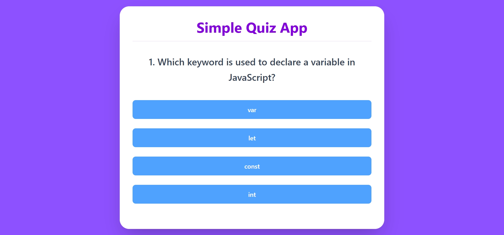
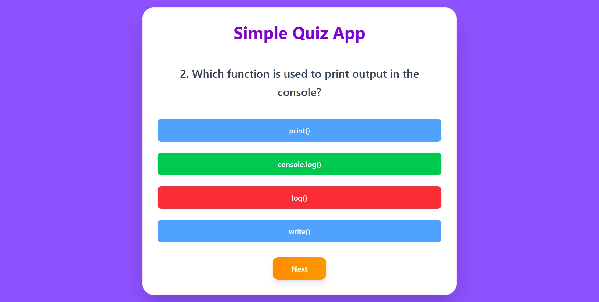
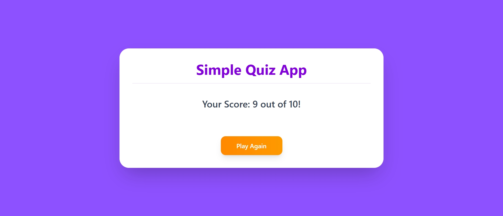

# 🎯 Simple Quiz App

A responsive and interactive Quiz Application built using **HTML**, **Tailwind CSS**, and **JavaScript**.
This app displays multiple-choice questions, checks answers instantly, and shows the final score at the end.

## Live at
[live@]()

## ✨ Features

* 📱 Fully Responsive Design
* 🎨 Modern Gradient UI
* ✅ Multiple Choice Questions
* 🟢 Correct Answer Highlight
* 🔴 Wrong Answer Highlight
* 📊 Final Score Display
* 🔄 Play Again Option
* ⚡ Smooth Hover Effects

---

## 🛠️ Technologies Used

* HTML5
* Tailwind CSS
* JavaScript (Vanilla JS)

## 📸 Preview

## 📚 Learning Concepts Used

* Arrays & Objects
* DOM Manipulation
* Event Listeners
* Functions
* Loops
* Conditional Statements
* Dynamic Button Creation

